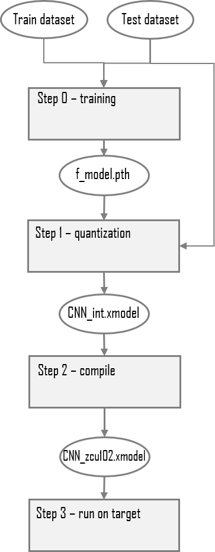
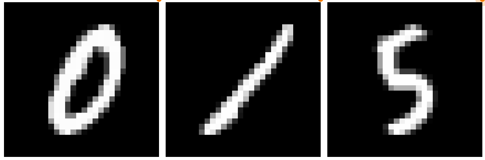
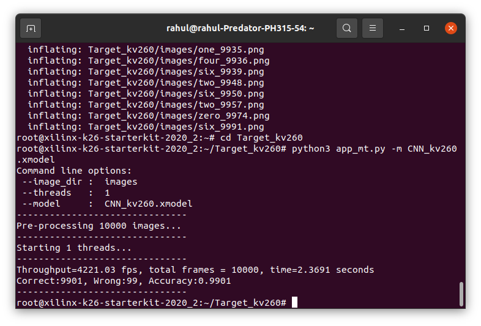
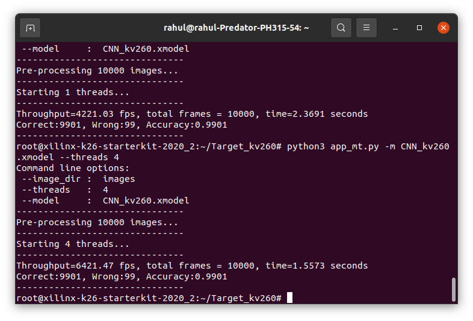

### Current Status

+ Tested on KV260
+ Tools used: PyTorch 1.4 & Vitis AI 1.4
+ Dataset: MNIST handwritten digits
+ Network: Custom CNN


## Introduction

We need to run the following steps:

+ Training and evaluation of a small custom convolutional neural network using PyTorch 1.4
+ Quantization and evaluation of the floating-point model.
+ Compilation of the quantized model to create the .xmodel files ready for execution on the DPU accelerator IP.
+ Download and run the application on the kv260 evaluation boards.




## The MNIST dataset

The MNIST handwritten digits dataset is a publicly available dataset that contains a total of 70k 8bit grayscale images each of which are 28pixels x 28pixels. The complete dataset of 70k images is normally divided into 60k images for training and 10k images for validation. The dataset is considered to be the 'hello world' of machine learning and makes a simple introduction to learn the complete Xilinx Vitis-AI flow. 




## Setting up the workspace

1. `git clone` the example to vitis-ai
2. Run the docker using `./docker_run.sh xilinx/vitis-ai-gpu:latest`
   (I have setup an alias in config file `alias docker_vitis_ai="./docker_run.sh xilinx/vitis-ai-gpu:latest"`)
3. Activate Pytorch Workflow inside docker: `conda activate vitis-ai-pytorch `
     
## Step 0 - Training Inside Vitis-AI docker

To run step 0:

```shell
(vitis-ai-pytorch) Vitis-AI /workspace > export BUILD=./build
(vitis-ai-pytorch) Vitis-AI /workspace > export LOG=${BUILD}/logs
(vitis-ai-pytorch) Vitis-AI /workspace > mkdir -p ${LOG}
(vitis-ai-pytorch) Vitis-AI /workspace > python -u train.py -d ${BUILD} 2>&1 | tee ${LOG}/train.log
```
The `train.py` script will execute the training of the CNN and save the trained floating-point model as a .pth file called `f_model.pth` into the ./build/float_model folder.

## Step 1 - Quantization

To run step 1:

```shell
(vitis-ai-pytorch) Vitis-AI /workspace > python -u quantize.py -d ${BUILD} --quant_mode calib 2>&1 | tee ${LOG}/quant_calib.log
(vitis-ai-pytorch) Vitis-AI /workspace > python -u quantize.py -d ${BUILD} --quant_mode test  2>&1 | tee ${LOG}/quant_test.log
```

The Xilinx DPU family of ML accelerators execute models and networks that have their parameters in integer format so we must convert the trained, floating-point checkpoint into a fixed-point integer checkpoint - this process is known as quantization.

Once quantization is finished, the quantized model can be found in the ./build/quant_model folder.

# Step 2 - Compiling for the target

To run step 2, execute the `compile.sh` shell script with one of the target boards as a command line argument, for example:

```shell
(vitis-ai-pytorch) Vitis-AI /workspace > source compile.sh kv260 ${BUILD} ${LOG}
```
The `compile.sh` shell script will compile the quantized model and create an .xmodel file which contains the instructions and data to be executed by the DPU. 


## Step 3 - Running the application on the target

To prepare the images, xmodel and application code for copying to the selected target, run the following command:

```shell
(vitis-ai-pytorch) Vitis-AI /workspace > python -u target.py --target kv260 -d ${BUILD} 2>&1 | tee ${LOG}/target_kv260.log
```

The `target.py` script will do the following:

+ Make a folder named ./build/target_<board_name>.
+ Copy the appropriate compiled model to the ./build/target_<board_name> folder.
+ Copy the Python application code to the ./build/target_<board_name> folder.
+ Convert the MNIST test dataset to PNG image files.
     + the number of images is set by the `--num_images` command line argument which defaults to 10000.

### KV260 Results:

+ Normal Output: **4221.03 FPS**
     - Command to run: `python3 app_mt.py -m CNN_kv260.xmodel`



+ Threads = 4: **6421.47 FPS**
     - Command to run: `python3 app_mt.py -m CNN_kv260.xmodel`
     


## References

+ [Vitis AI Optimizer User Guide (UG1333)](https://www.xilinx.com/support/documentation/sw_manuals/vitis_ai/1_2/ug1333-ai-optimizer.pdf)

+ [Vitis AI User Guide (UG1414)](https://www.xilinx.com/support/documentation/sw_manuals/vitis_ai/1_2/ug1414-vitis-ai.pdf) 


